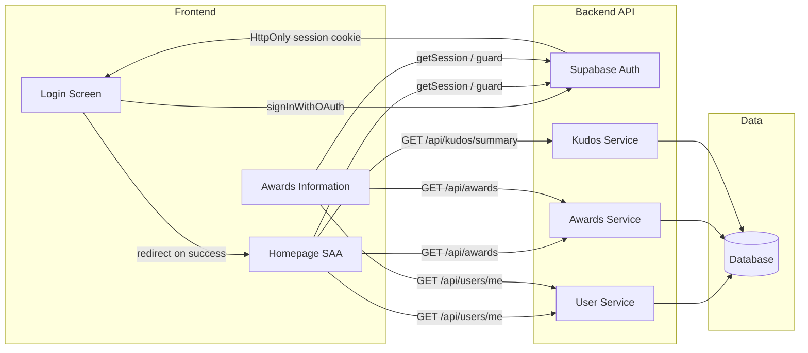

# Screen Flow Overview — my-app (SAA 2025)

## Project Info
- **Project Name**: my-app (Sun* Asia Awards 2025 — "Root Further")
- **Figma File Key**: `9ypp4enmFmdK3YAFJLIu6C`
- **Figma URL**: https://www.figma.com/design/9ypp4enmFmdK3YAFJLIu6C
- **Created**: 2026-04-21
- **Last Updated**: 2026-04-27 (Language Dropdown overlay frame `hUyaaugye2` discovered)

---

## Discovery Progress

| Metric | Count |
|--------|-------|
| Total Screens (known) | 7 |
| Discovered (spec drafted) | 4 |
| Pending (TBD) | 3 |
| Completion | 57% |

---

## Screens

| # | Screen Name | Frame ID | Figma Link | Status | Detail File | Predicted APIs | Navigations To |
|---|-------------|----------|------------|--------|-------------|----------------|----------------|
| 1 | Login | `GzbNeVGJHz` | [Figma](https://www.figma.com/design/9ypp4enmFmdK3YAFJLIu6C?node-id=GzbNeVGJHz) | discovered | `.momorph/specs/GzbNeVGJHz-Login/spec.md` | Supabase `auth.signInWithOAuth`, `/auth/callback`, Supabase `auth.getSession` | Homepage SAA (on success) |
| 2 | Homepage SAA | `i87tDx10uM` | [Figma](https://www.figma.com/design/9ypp4enmFmdK3YAFJLIu6C?node-id=i87tDx10uM) | discovered | `.momorph/specs/i87tDx10uM-Homepage-SAA/spec.md` | Supabase `auth.getSession`, Supabase `auth.signOut`, i18n/locale switch, (predicted) `/api/users/me`, `/api/awards`, `/api/kudos/summary` | Awards Information, Sun* Kudos, Profile, Admin Dashboard, Login (on sign-out) |
| 3 | Awards Information ("Hệ thống giải") | `zFYDgyj_pD` | [Figma](https://www.figma.com/design/9ypp4enmFmdK3YAFJLIu6C?node-id=zFYDgyj_pD) | discovered | `.momorph/specs/zFYDgyj_pD-He-thong-giai/spec.md` | (predicted) `/api/awards`, `/api/users/me`, `/api/i18n/:locale`, Supabase `auth.getSession` | Sun* Kudos (D1 "Chi tiết"), Homepage SAA (header/footer), Profile, Admin Dashboard, Login (sign-out) |
| 4 | Sun* Kudos | TBD | TBD | pending (route reserved: `/kudos`) | — | (predicted) `/api/kudos`, `/api/kudos/summary` | Homepage SAA, Awards Information |
| 5 | Profile | TBD | TBD | pending | — | (predicted) `/api/users/me` | Homepage SAA |
| 6 | Admin Dashboard | TBD | TBD | pending | — | TBD | Homepage SAA |
| 7 | Language Dropdown ("Dropdown-ngôn ngữ") — overlay | `hUyaaugye2` | [Figma](https://www.figma.com/design/9ypp4enmFmdK3YAFJLIu6C?node-id=hUyaaugye2) | discovered | `.momorph/specs/hUyaaugye2-Dropdown-ngon-ngu/spec.md` | (predicted) `GET /api/i18n/:locale`, optional `PUT /api/users/me { locale }` | (no route change — re-renders current screen in new locale) |

---

## Navigation Graph

```mermaid
flowchart TD
    subgraph Auth["Authentication"]
        Login["Login (/)"]
    end

    subgraph Main["Main Application (authenticated)"]
        Home["Homepage SAA (/about-saa-2025)"]
        Awards["Awards Information (/awards)"]
        Kudos["Sun* Kudos (/kudos)"]
        Profile["Profile (TBD)"]
        Admin["Admin Dashboard (TBD)"]
    end

    subgraph Overlays["In-page Overlays"]
        LangMenu["Language Dropdown<br/>(frame hUyaaugye2)<br/>VN / EN"]
        AvatarMenu["Avatar Dropdown (Profile / Sign out / Admin)"]
        QuickActions["Floating Widget Menu (TBD destinations)"]
    end

    %% Auth entry/exit
    Login -- "LOGIN With Google → /auth/callback" --> Home
    Home -- "Avatar → Sign out" --> Login
    Awards -- "Avatar → Sign out" --> Login

    %% Header / Footer menu (shared)
    Home -- "About SAA 2025 (self)" --> Home
    Home -- "Awards Information" --> Awards
    Home -- "Sun* Kudos" --> Kudos
    Awards -- "About SAA 2025" --> Home
    Awards -- "Award Information (self)" --> Awards
    Awards -- "Sun* Kudos" --> Kudos

    %% Hero CTAs (Homepage)
    Home -- "ABOUT AWARDS" --> Awards
    Home -- "ABOUT KUDOS" --> Kudos

    %% Award cards on Homepage (6 items) — deep-link to Awards page with anchor
    Home -- "Award card: Top Talent" --> Awards
    Home -- "Award card: Top Project" --> Awards
    Home -- "Award card: Top Project Leader" --> Awards
    Home -- "Award card: Best Manager" --> Awards
    Home -- "Award card: Signature 2025 - Creator" --> Awards
    Home -- "Award card: MVP" --> Awards

    %% In-page anchor scroll on Awards (Menu list C.1–C.6 → D.1–D.6)
    Awards -- "C.1 Top Talent → #top-talent" --> Awards
    Awards -- "C.2 Top Project → #top-project" --> Awards
    Awards -- "C.3 Top Project Leader → #top-project-leader" --> Awards
    Awards -- "C.4 Best Manager → #best-manager" --> Awards
    Awards -- "C.5 Signature 2025 - Creator → #signature-2025-creator" --> Awards
    Awards -- "C.6 MVP → #mvp" --> Awards

    %% D1 Sun* Kudos block (shared between Home and Awards)
    Home -- "Chi tiết" --> Kudos
    Awards -- "D2.1 Chi tiết" --> Kudos

    %% Overlays
    Home -- "Language button (A1.7)" --> LangMenu
    Home -- "Avatar (A1.8)" --> AvatarMenu
    Awards -- "Language button (header)" --> LangMenu
    Awards -- "Avatar (header)" --> AvatarMenu
    Home -- "Floating Widget Button (6_Widget Button)" --> QuickActions
    AvatarMenu --> Profile
    AvatarMenu --> Admin
    AvatarMenu --> Login

    %% Language Dropdown selections (no route change — re-renders caller in new locale)
    LangMenu -- "Select VN (A.1)" --> Home
    LangMenu -- "Select EN (A.2)" --> Home
    LangMenu -- "Select VN (A.1)" --> Awards
    LangMenu -- "Select EN (A.2)" --> Awards
```

---

## Screen Groups

### Group: Authentication
| Screen | Purpose | Entry Points |
|--------|---------|--------------|
| Login | Google OAuth sign-in (only auth method) | App launch, sign-out, any unauthenticated request to a protected route |

### Group: Main Application (authenticated)
| Screen | Purpose | Entry Points |
|--------|---------|--------------|
| Homepage SAA | Main landing page after login — overview of "About SAA 2025" with hero, award cards, Kudos teaser | Login success, header/footer "About SAA 2025" link |
| Awards Information ("Hệ thống giải") | Detailed reference page for the SAA 2025 award system — keyvisual, side-anchor menu and 6 detail blocks (Top Talent, Top Project, Top Project Leader, Best Manager, Signature 2025 - Creator, MVP), plus a Sun* Kudos teaser | Homepage header/footer "Award Information" link, Homepage hero "ABOUT AWARDS" CTA, any of the 6 award cards on Homepage (deep-link by anchor), Awards Information link in footer of any other page |
| Sun* Kudos | Sun* Kudos program overview and recognition feed | Homepage header/footer link, Homepage hero "ABOUT KUDOS" CTA, Homepage "Chi tiết" button, Awards Information D2.1 "Chi tiết" button |
| Profile | User profile view / edit | Avatar dropdown → "Profile" |
| Admin Dashboard | Admin-only management area | Avatar dropdown → "Admin Dashboard" (shown only for admin users) |

### Group: In-page Overlays (no route change)
| Overlay | Frame ID | Purpose | Triggered From |
|---------|----------|---------|----------------|
| Language Dropdown ("Dropdown-ngôn ngữ") | `hUyaaugye2` (discovered) — spec at `.momorph/specs/hUyaaugye2-Dropdown-ngon-ngu/spec.md` | Switch display language between Vietnamese (`vi`, default, active row) and English (`en`). Two-row popover; selection updates global locale and re-renders the host screen with no route change. | Header language button on every authenticated page (Homepage SAA `A1.7`, Awards Information header, etc.) |
| Avatar Dropdown | TBD | User-scoped actions: Profile, Sign out, Admin Dashboard | Header avatar on authenticated pages |
| Floating Widget Menu | TBD | Quick-action shortcuts (destinations TBD) | Floating widget button on Homepage (not present on Awards Information per current design) |

---

## Screen Detail — Homepage SAA

- **Frame ID**: `i87tDx10uM`
- **File Key**: `9ypp4enmFmdK3YAFJLIu6C`
- **Spec**: `.momorph/specs/i87tDx10uM-Homepage-SAA/spec.md` (pending)
- **Route (proposed)**: `/about-saa-2025` (or `/` for authenticated users; final route TBD)
- **Purpose**: Primary landing page after successful login. Introduces SAA 2025, presents the six
  award categories, and surfaces the Sun* Kudos program.
- **Access**: Authenticated users only. Unauthenticated requests redirect to Login.

### Navigation Triggers

| Trigger Element | Interaction | Destination | Notes |
|-----------------|-------------|-------------|-------|
| Header menu: "About SAA 2025" | Click | Homepage SAA (self) | Active state — no-op / scroll to top |
| Header menu: "Awards Information" | Click | Awards Information page (`/awards`) | Route reserved |
| Header menu: "Sun* Kudos" | Click | Sun* Kudos page (`/kudos`) | Route reserved (screen still pending) |
| Hero CTA "ABOUT AWARDS" | Click | Awards Information page (`/awards`) | Route reserved |
| Hero CTA "ABOUT KUDOS" | Click | Sun* Kudos page (`/kudos`) | Route reserved (screen still pending) |
| Award card — Top Talent | Click | Awards Information (`#top-talent`) | Hash/slug anchor |
| Award card — Top Project | Click | Awards Information (`#top-project`) | Hash/slug anchor |
| Award card — Top Project Leader | Click | Awards Information (`#top-project-leader`) | Hash/slug anchor |
| Award card — Best Manager | Click | Awards Information (`#best-manager`) | Hash/slug anchor |
| Award card — Signature 2025 - Creator | Click | Awards Information (`#signature-2025-creator`) | Hash/slug anchor |
| Award card — MVP | Click | Awards Information (`#mvp`) | Hash/slug anchor |
| D1 Sun* Kudos block — "Chi tiết" button | Click | Sun* Kudos page (`/kudos`) | Route reserved (screen still pending) |
| Floating Widget Button (`6_Widget Button`) | Click | Quick-action menu (overlay) | **TBD** — destinations not defined yet |
| Avatar icon (`A1.8`) | Click | Avatar Dropdown overlay → Profile / Sign out / Admin Dashboard | Sign-out returns to Login; Admin Dashboard shown only for admin role |
| Language button (`A1.7`) | Click | Language Menu overlay (VN / EN) | In-page language switch, no route change |
| Footer menu (same items as header) | Click | Same destinations as header | Mirrors header links |
| Logo (top-left) | Click | Homepage SAA (self) or `/` | Standard brand-home behaviour |

### Guards

- Unauthenticated users MUST be redirected to Login before this page renders.
- "Admin Dashboard" item in the avatar dropdown MUST only be visible to users with the admin role.

---

## Screen Detail — Awards Information ("Hệ thống giải")

- **Frame ID**: `zFYDgyj_pD`
- **File Key**: `9ypp4enmFmdK3YAFJLIu6C`
- **Spec**: `.momorph/specs/zFYDgyj_pD-He-thong-giai/spec.md`
- **Design style**: `.momorph/specs/zFYDgyj_pD-He-thong-giai/design-style.md`
- **Route**: `/awards` (alias used by Homepage award cards as `/awards#<award-slug>`)
- **Purpose**: Single, scrollable reference page that explains the SAA 2025 "Hệ thống giải thưởng"
  — i.e. the full set of 2025 award categories, the number of awards in each category, and the
  monetary value per award. Acts as the canonical landing target for every "ABOUT AWARDS" /
  "Award Information" / award-card click on Homepage.
- **Access**: Authenticated users only. Unauthenticated requests redirect to Login.
- **Layout summary** (top → bottom):
  1. Shared header (logo, "About SAA 2025" / "Award Information" / "Sun* Kudos" menu, notification, language switch, avatar) — `Award Information` is the active item.
  2. `3_Keyvisual` — hero banner with "ROOT FURTHER" / "Sun* Annual Awards 2025".
  3. `A_Title` — "Hệ thống giải thưởng SAA 2025".
  4. `B_Hệ thống giải thưởng` — two-column block:
     - Left: `C_Menu list` with 6 anchor items (`C.1`–`C.6`).
     - Right: `D.1`–`D.6` award detail cards (image + title + description + "Số lượng giải thưởng" + "Giá trị giải thưởng").
  5. `D1_Sunkudos` — Sun* Kudos teaser block with `D2.1 Chi tiết` CTA.
  6. Shared footer (mirrors header menu + "Tiêu chuẩn chung" + copyright).

### Navigation Triggers

| Trigger Element | Interaction | Destination | Notes |
|-----------------|-------------|-------------|-------|
| Header logo | Click | Homepage SAA | Standard brand-home behaviour |
| Header menu: "About SAA 2025" | Click | Homepage SAA | Route TBD (open question on Homepage spec) |
| Header menu: "Award Information" | Click | Awards Information (self) | Active state — scroll to top |
| Header menu: "Sun* Kudos" | Click | Sun* Kudos page (`/kudos`) | Route reserved (screen still pending) |
| Header notification icon | Click | Notifications overlay | **TBD** — overlay destinations not yet defined |
| Header language button (VN ▾) | Click | Language Menu overlay (VN / EN) | In-page locale switch, no route change |
| Header avatar | Click | Avatar Dropdown overlay (Profile / Sign out / Admin Dashboard) | Sign-out → Login; Admin item visible only for admin role |
| `C.1` Top Talent (menu item) | Click | Awards Information `#top-talent` (scrolls to `D.1`) | Sets active state on `C.1` |
| `C.2` Top Project | Click | Awards Information `#top-project` (scrolls to `D.2`) | Sets active state on `C.2` |
| `C.3` Top Project Leader | Click | Awards Information `#top-project-leader` (scrolls to `D.3`) | Sets active state on `C.3` |
| `C.4` Best Manager | Click | Awards Information `#best-manager` (scrolls to `D.4`) | Sets active state on `C.4` |
| `C.5` Signature 2025 - Creator | Click | Awards Information `#signature-2025-creator` (scrolls to `D.5`) | Sets active state on `C.5` |
| `C.6` MVP | Click | Awards Information `#mvp` (scrolls to `D.6`) | Sets active state on `C.6` |
| `D.1`–`D.6` award cards | — | (none — read-only info blocks) | No click navigation; they are scroll targets, not links |
| `D1_Sunkudos` block — `D2.1 Chi tiết` button | Click | Sun* Kudos page (`/kudos`) | Route reserved (screen still pending) |
| Footer menu items | Click | Same destinations as header (About SAA 2025 / Award Information / Sun* Kudos / Tiêu chuẩn chung) | "Tiêu chuẩn chung" destination is **TBD** (likely a static page) |

### Guards

- Unauthenticated users MUST be redirected to Login before this page renders.
- "Admin Dashboard" item in the avatar dropdown MUST only be visible to users with the admin role.
- Award category list/values are static-by-design but should be sourced from `/api/awards` (predicted) so they can be edited without redeployment; if the API fails, the page should still render with cached/last-known data.

### Anchor / Slug Map

| Award (display) | Anchor / slug |
|------------------|---------------|
| Top Talent | `top-talent` |
| Top Project | `top-project` |
| Top Project Leader | `top-project-leader` |
| Best Manager | `best-manager` |
| Signature 2025 - Creator | `signature-2025-creator` |
| MVP | `mvp` |

---

## Screen Detail — Language Dropdown ("Dropdown-ngôn ngữ")

- **Frame ID**: `hUyaaugye2` (Figma node `721:4942`)
- **File Key**: `9ypp4enmFmdK3YAFJLIu6C`
- **Spec**: `.momorph/specs/hUyaaugye2-Dropdown-ngon-ngu/spec.md`
- **Type**: In-page overlay (popover) — **no route change**
- **Purpose**: Lets the authenticated user switch the display language between
  Vietnamese (`vi`, default — active row in the design) and English (`en`).
- **Anchor / Trigger**: Header language button on every authenticated screen
  (Homepage SAA `A1.7`, Awards Information header language button, and the
  equivalent button on Sun* Kudos / Profile / Admin Dashboard once those are
  discovered).
- **Access**: Authenticated users only — overlay lives inside the authenticated
  header. (Login screen has its own pre-auth language switch outside the scope
  of this overlay.)
- **Layout summary**: Compact two-row vertical list (`A_Dropdown-List`):
  1. `A.1_tiếng Việt` — VN flag + label `VN` (active state — solid red row).
  2. `A.2_tiếng Anh` — UK flag + label `EN`.

### Navigation Triggers

| Trigger Element | Interaction | Destination | Notes |
|-----------------|-------------|-------------|-------|
| `A.1_tiếng Việt` row (`I525:11713;362:6085`) | Click | Host screen re-rendered in `vi` | Sets global locale = `vi`; closes overlay; no route change |
| `A.2_tiếng Anh` row (`I525:11713;362:6128`) | Click | Host screen re-rendered in `en` | Sets global locale = `en`; closes overlay; no route change |
| Click outside / `Esc` | Dismiss | Host screen (unchanged) | Standard popover dismiss |

### Guards

- Overlay only renders inside the authenticated layout — no separate auth guard
  is required, but the host page must already have passed its auth guard.
- The active row indicator (red background) MUST reflect the current global
  locale on every open, not a hard-coded `vi`.

### API & State Hooks

- Reads current `locale` from the global i18n context.
- On selection: client-side locale switch (instant) + optional
  `GET /api/i18n/:locale` if translation bundles are lazy-loaded + optional
  fire-and-forget `PUT /api/users/me { locale }` to persist the preference
  (only if backend stores per-user locale — TBD).

### Open Items

- Two TEXT nodes inside the rows are still named
  `Awards Information Navigation Links` in Figma (copy-paste leftover). The
  rendered text in the exported image is `VN` / `EN`, which is what
  implementation should use.
- The English flag in Figma is currently a `GB-NIR - Northern Ireland` instance
  but renders as the Union-Jack `EN` flag — implement with the standard
  United-Kingdom flag asset.

---

## API Endpoints Summary

| Endpoint | Method | Screens Using | Purpose | Status |
|----------|--------|---------------|---------|--------|
| Supabase `auth.signInWithOAuth` | — | Login | Google OAuth redirect | Supabase built-in |
| `/auth/callback` | GET | Login | Exchange OAuth code → session cookie | New — required |
| Supabase `auth.getSession` | — | Login, Homepage SAA, Awards Information | Session check / guard | Supabase built-in |
| Supabase `auth.signOut` | — | Homepage SAA, Awards Information (avatar dropdown) | Sign the user out | Supabase built-in |
| `/api/users/me` | GET | Homepage SAA, Awards Information, Profile | Current user info (avatar, name, role) — needed to render header | Predicted |
| `/api/awards` | GET | Homepage SAA, Awards Information | List of award categories (title, description, count, value, image, slug) | Predicted |
| `/api/awards/:slug` | GET | (Homepage SAA only — speculative) | Single award detail (used if award blocks are lazy-loaded). **NOT** used by Awards Information per its spec — that page renders all 6 awards from the single `/api/awards` list call. | Speculative |
| `/api/kudos/summary` | GET | Homepage SAA only | Kudos teaser content for the D1 block on Homepage SAA. **NOT** used by Awards Information per its spec — the `D1_Sunkudos` teaser on the awards page uses static i18n strings, not live API data. | Predicted |
| `/api/i18n/:locale` | GET | All screens (triggered via Language Dropdown overlay) | Localised strings (VN/EN); fetched lazily when the user switches locale via the Language Dropdown (`hUyaaugye2`) | Predicted |
| `/api/users/me` | PUT | Language Dropdown (overlay), Profile, Settings (TBD) | Persist user locale preference `{ locale: "vi" \| "en" }` after a Language Dropdown selection (fire-and-forget; only if backend stores per-user locale) | Predicted / Optional |

---

## Data Flow

---

## Technical Notes

### Authentication Flow
- Google OAuth via Supabase Auth (sole method).
- HttpOnly session cookie set by `/auth/callback` after `exchangeCodeForSession`.
- Homepage SAA and Awards Information are behind an auth guard; sign-out returns to Login.

### State Management
- Global: Supabase Auth context, i18n/locale context.
- Server state: React Query / SWR (TBD) for `/api/users/me`, `/api/awards`, `/api/kudos/summary` (Homepage only). Awards Information does NOT call `/api/kudos/summary` — its Sun* Kudos teaser uses static i18n copy.
- Awards Information also tracks a UI-only `activeAward` state driven by scroll position / clicks on `C.1`–`C.6`, which the side-menu uses to render its active indicator (yellow + underline).

### Routing
- Next.js App Router (per constitution).
- Protected routes: everything except `/` (Login) and `/auth/callback`.
- Awards Information uses URL hashes (`#top-talent`, `#top-project`, …) so deep-links from Homepage award cards land on the right section.

### i18n
- Default locale: Vietnamese (`vi`). Alternate: English (`en`).
- Language menu is a shared overlay available in the header on every screen, including Awards Information.

---

## Discovery Log

| Date | Action | Screens | Notes |
|------|--------|---------|-------|
| 2026-04-21 | Initial discovery | Login | Single auth entry point via Google OAuth |
| 2026-04-22 | Added Homepage SAA | Homepage SAA | Post-login landing; header/footer/hero/cards/D1 navigation mapped. Awards Information, Sun* Kudos, Profile, Admin Dashboard added as pending destinations |
| 2026-04-26 | Added Awards Information ("Hệ thống giải") | Awards Information | Frame `zFYDgyj_pD`. Maps the 6 award detail blocks (D.1–D.6) and the C.1–C.6 anchor menu, plus the embedded D1 Sun* Kudos teaser. Confirmed proposed route `/awards` and anchor/slug scheme used by Homepage award-card deep-links |
| 2026-04-26 | Reserved Sun* Kudos route as `/kudos` | Sun* Kudos | Default decision pending screen discovery — chosen for short-form parity with `/awards` and `/about-saa-2025`. Locks the destination of the "Chi tiết" CTA on Homepage SAA and Awards Information so implementation is unblocked. Rename if design provides an alternative. |
| 2026-04-26 | `momorph.specify` + `momorph.reviewspecify` for Awards Information | Awards Information | spec.md + design-style.md drafted, reviewed, and corrected: alternating zig-zag award rows (D.1/3/5 image-left, D.2/4/6 image-right), Sun* Kudos block confirmed as two-column row (not flex-column), Awards-Name overlay confirmed as raster asset (not live text). |
| 2026-04-27 | Discovered Language Dropdown overlay | Language Dropdown ("Dropdown-ngôn ngữ") | Frame `hUyaaugye2` mapped via `momorph.screenflow`. Two-row popover (`A.1` VN active / `A.2` EN), anchored to header language button on every authenticated page; selection switches global locale with no route change. Spec drafted at `.momorph/specs/hUyaaugye2-Dropdown-ngon-ngu/spec.md`. Predicted APIs: `GET /api/i18n/:locale`, optional `PUT /api/users/me { locale }`. Noted Figma cleanup items (stale TEXT layer name `Awards Information Navigation Links`; `GB-NIR` flag instance used for the EN row but renders as Union-Jack). |

---

## Next Steps / Open Questions

- [ ] Confirm final route for Homepage SAA (`/` vs. `/about-saa-2025`) — resolves `TODO(POST_AUTH_REDIRECT)` from the Login spec.
- [x] Confirm route for Awards Information — locked in as `/awards` 2026-04-26.
- [x] Discover and spec the **Awards Information** screen — frame `zFYDgyj_pD` mapped, `spec.md` + `design-style.md` drafted under `.momorph/specs/zFYDgyj_pD-He-thong-giai/` 2026-04-26.
- [x] Reserve route for **Sun* Kudos** — locked in as `/kudos` 2026-04-26 so the awards-page "Chi tiết" CTA can be implemented; the screen itself still needs Figma discovery and a spec.
- [ ] Discover and spec the **Sun* Kudos** screen (destination of hero "ABOUT KUDOS" + Homepage "Chi tiết" + Awards Information `D2.1 Chi tiết` + header/footer link). Route already reserved as `/kudos`.
- [ ] Discover and spec the **Profile** screen (avatar dropdown → Profile).
- [ ] Discover and spec the **Admin Dashboard** (avatar dropdown → Admin Dashboard; admin-only).
- [ ] Define destination for the header notification icon on Awards Information (and likely Homepage too).
- [ ] Define destination for footer "Tiêu chuẩn chung" link.
- [ ] Define destinations for the Floating Widget Button quick-action menu on Homepage (currently TBD).
- [ ] Verify navigation paths with the design team and map all predicted APIs (`/api/awards`, `/api/awards/:slug`, `/api/kudos/summary`, `/api/users/me`, `/api/i18n/:locale`) to real endpoints.
- [x] Discover and spec the **Language Dropdown** overlay — frame `hUyaaugye2` mapped, `spec.md` drafted under `.momorph/specs/hUyaaugye2-Dropdown-ngon-ngu/` 2026-04-27.
- [ ] Confirm whether `user.locale` is persisted by the backend (drives the optional `PUT /api/users/me` call from the Language Dropdown).
- [ ] Clean up Figma layer names inside frame `hUyaaugye2`: rename the two TEXT nodes from `Awards Information Navigation Links` → `VN` / `EN`, and replace the `GB-NIR - Northern Ireland` flag instance with the standard `GB - United Kingdom` instance for the English row.
