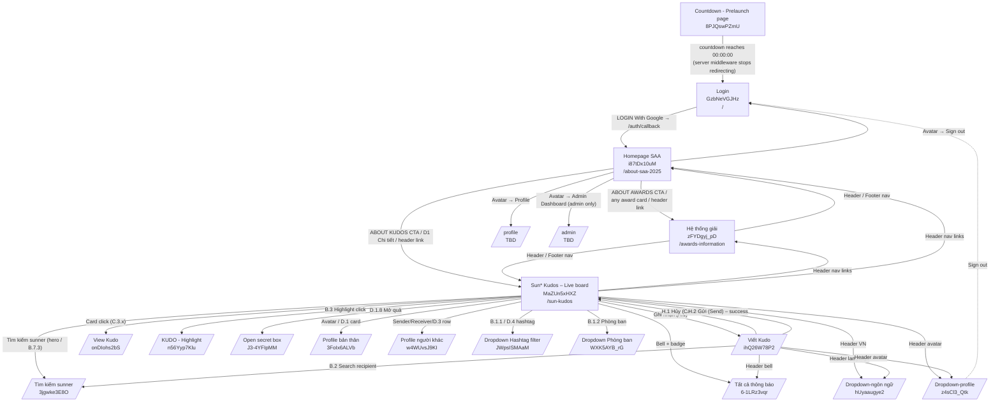

# Screen Flow — my-app (SAA 2025)

## Project Info

- **Project Name**: my-app (Sun\* Annual Awards 2025)
- **Figma File Key**: `9ypp4enmFmdK3YAFJLIu6C`
- **Figma URL**: https://www.figma.com/design/9ypp4enmFmdK3YAFJLIu6C
- **Created**: 2026-04-22
- **Last Updated**: 2026-04-27

---

## Discovery Progress

| Metric | Count |
|--------|-------|
| Total Screens (in scope so far) | 6 |
| Discovered | 6 |
| Remaining | 0 |
| Completion | 100% |

> Scope is the set of frames that have been requested for spec generation; the Figma file may contain additional frames not yet onboarded.

---

## Navigation Graph

---

## Screens

| # | Screen Name | Frame ID | Figma Link | Status | Detail File | Predicted APIs | Navigations To |
|---|-------------|----------|------------|--------|-------------|----------------|----------------|
| 1 | Countdown - Prelaunch page | `8PJQswPZmU` | [Figma](https://www.figma.com/design/9ypp4enmFmdK3YAFJLIu6C/?node-id=2268:35127) | discovered | [`screen_specs/countdown-prelaunch.md`](screen_specs/countdown-prelaunch.md) | (none — env-driven) | Login (after countdown ends) |
| 2 | Login | `GzbNeVGJHz` | (root frame) | analyzed | (legacy spec — see `.momorph/specs/GzbNeVGJHz-Login/`) | `supabase.auth.*`, Google OAuth | Homepage SAA |
| 3 | Homepage SAA | `i87tDx10uM` | (root frame) | analyzed | (legacy spec — see `.momorph/specs/i87tDx10uM-Homepage-SAA/`) | `GET /api/notifications/unread-count`, `supabase.auth.*` | Awards Information, Sun\* Kudos, Profile, Admin, Login |
| 4 | Hệ thống giải (Awards Information) | `zFYDgyj_pD` | (root frame) | discovered | (spec stub at `.momorph/specs/zFYDgyj_pD-He-thong-giai/`) | TBD | Homepage SAA, Sun\* Kudos |
| 5 | Sun\* Kudos – Live board | `MaZUn5xHXZ` | [Figma](https://www.figma.com/design/9ypp4enmFmdK3YAFJLIu6C/?node-id=2940-13431) | discovered | [`screen_specs/sun-kudos-live-board.md`](screen_specs/sun-kudos-live-board.md) | `GET /users/me`, `GET /users/me/stats`, `GET /kudos`, `GET /kudos/highlights`, `GET /kudos/stats/total`, `GET /sunners/top`, `GET /hashtags`, `GET /departments`, `POST/DELETE /kudos/:id/likes`, `GET /notifications`, `WS /ws/kudos` | Viết Kudo, Tìm kiếm sunner, View Kudo, KUDO - Highlight, Open secret box, Tất cả thông báo, Profile bản thân, Profile người khác, Dropdown Hashtag filter, Dropdown Phòng ban, Dropdown-ngôn ngữ, Dropdown-profile, Homepage SAA, Hệ thống giải, Thể lệ |
| 6 | Viết Kudo | `ihQ26W78P2` | [Figma](https://www.figma.com/design/9ypp4enmFmdK3YAFJLIu6C/?node-id=520-11602) | discovered | [`screen_specs/viet-kudo.md`](screen_specs/viet-kudo.md) | `GET /api/sunners?q=`, `GET /api/hashtags`, `POST /api/kudos`, `POST /api/media/upload` | Sun\* Kudos – Live board (cancel / submit), Tìm kiếm sunner (recipient search), Dropdown-ngôn ngữ, Dropdown-profile, Notifications |

---

## Screen Groups

### Group: Prelaunch / Marketing

| Screen | Purpose | Entry Points |
|--------|---------|--------------|
| Countdown - Prelaunch page | Holding screen during prelaunch window — gates the entire app behind a date check | All routes (server middleware redirect) when `now() < NEXT_PUBLIC_PRELAUNCH_END` |

### Group: Authentication

| Screen | Purpose | Entry Points |
|--------|---------|--------------|
| Login | Google OAuth entry point | App launch (post-prelaunch), Sign-out |

### Group: Main Application

| Screen | Purpose | Entry Points |
|--------|---------|--------------|
| Homepage SAA | Post-auth landing — countdown + campaign + award grid | `/auth/callback` success, direct entry while authenticated |
| Hệ thống giải | Detailed award category page | Homepage CTAs, header/footer link |

### Group: Kudos

| Screen | Purpose | Entry Points |
|--------|---------|--------------|
| Sun\* Kudos – Live board | Real-time Kudos dashboard: hero CTAs, spotlight carousel, full Kudos feed, personal stats, top-sunners leaderboard, hashtag cloud; **B.7.4** activity on Spotlight canvas | Homepage "ABOUT KUDOS" CTA / "D1 Chi tiết", header nav, header logo (when authed), notification deep-link |
| Viết Kudo | Modal compose form to send a peer recognition (Kudo) with recipient, title, rich-text body, hashtags, images, and optional anonymous send | Live board "Ghi nhận" CTA (`A.1_Button ghi nhận`) |

---

## API Endpoints Summary

| Endpoint | Method | Screens Using | Purpose |
|----------|--------|---------------|---------|
| Google OAuth (Supabase) | — | Login | Sign-in |
| `supabase.auth.signOut()` | — | Homepage SAA, Live board (via Dropdown-profile) | Sign-out from avatar menu |
| `GET /api/notifications/unread-count` | GET | Homepage SAA, Live board (header bell) | Bell-badge count |
| `GET /api/user/role` | GET | Homepage SAA | Conditional admin menu (preferred: read JWT claim instead) |
| `GET /api/users/me` | GET | Live board (header + personal panel) | Current user |
| `GET /api/users/me/stats` | GET | Live board (D.1) | Personal counters: kudos in/out, hearts, secret boxes opened/total |
| `GET /api/kudos` | GET | Live board (C feed, **B.7.4** activity seed) | Paginated public Kudos feed (filters: `hashtag`, `dept`, `page`) |
| `GET /api/kudos/highlights` | GET | Live board (B spotlight) | Featured Kudos for carousel |
| `GET /api/kudos/stats/total` | GET | Live board (B.7.1 "388 KUDOS") | Global counter |
| `GET /api/kudos/:id` | GET | View Kudo | Single Kudos detail (linked from feed) |
| `POST/DELETE /api/kudos/:id/likes` | POST/DELETE | Live board (C.4.1), View Kudo | Heart / unheart |
| `GET /api/sunners/top` | GET | Live board (D.3) | Top sunners leaderboard |
| `GET /api/sunners?q=` | GET | Tìm kiếm sunner overlay (Live board) | Search sunners |
| `GET /api/hashtags` | GET | Live board (B.1.1, D.4) | Trending hashtags |
| `GET /api/departments` | GET | Live board (B.1.2) | Department filter list |
| `GET /api/notifications` | GET | Live board, Tất cả thông báo | Notifications list |
| `WS /ws/kudos` | WS | Live board | Realtime new-kudos / likes; optional **B.7.4** invalidation |
| `GET /api/me/secret-boxes/next` | GET | Live board → Open secret box | Get next unopened gift |
| `GET /api/sunners?q=` | GET | Viết Kudo (B.2 recipient search), Live board (Tìm kiếm sunner) | Sunner autocomplete — consolidated entry |
| `POST /api/kudos` | POST | Viết Kudo (submit) | Create a new Kudo post |
| `POST /api/media/upload` | POST | Viết Kudo (image upload) | Upload image attachments; returns URL |

> Countdown - Prelaunch page intentionally has **no API calls** — the "is prelaunch active" decision is server-side via env-var driven middleware.

---

## Technical Notes

### Prelaunch Gate (NEW — 2026-04-26)

- A Next.js middleware (extending or replacing the existing `proxy.ts`) MUST inspect every request and rewrite/redirect to the Countdown - Prelaunch page when `Date.now() < NEXT_PUBLIC_PRELAUNCH_END`.
- The prelaunch route itself must be allowlisted by the middleware to avoid a redirect loop.
- Static asset paths (`/_next/*`, `/public/*`, `/favicon.ico`) MUST be excluded from the gate.
- Once the cut-off passes, the middleware silently lets requests through to their normal destinations — no client-side migration is needed.

### Authentication Flow

- Supabase SSR (`@supabase/ssr`) — sessions in cookies (HttpOnly).
- Google OAuth is the sole sign-in method; no email/password.
- `proxy.ts` is the auth middleware today; the prelaunch gate composes with it (gate runs first).

### State Management

- No global client store. Server Components for data; small Client islands for interactivity (countdown, dropdowns).
- **Live board** introduces TanStack Query for cached server state (kudos feed, highlights, stats, leaderboard) and **Supabase Realtime** (or WS `/ws/kudos`) for feed / like events and future **B.7.4** sync.
- i18n: `next-intl` with `vi` (default) and `en` locales.

### Routing

- Next.js App Router (`app/` directory).
- Public routes: `/` (Login), `/auth/*` (callbacks).
- Protected routes (require auth post-prelaunch): `/about-saa-2025`, `/awards-information`, `/sun-kudos`, `/profile`, `/admin`.
- Prelaunch route: `/prelaunch` (or implementer's chosen path) — served only while the gate is active.

---

## Discovery Log

| Date | Action | Screens | Notes |
|------|--------|---------|-------|
| 2026-04-22 | Initial discovery | Login, Homepage SAA | Two foundational screens captured during prior cycles |
| 2026-04-22 | Continued | Hệ thống giải | Awards Information sibling discovered |
| 2026-04-26 | Continued | Countdown - Prelaunch page | New prelaunch gate frame added; server middleware redirect documented |
| 2026-04-26 | Continued | Sun\* Kudos – Live board (`MaZUn5xHXZ`) | Detail spec at `.momorph/contexts/screen_specs/sun-kudos-live-board.md`. Identified 14+ outgoing navigations and ~16 predicted endpoints (+ WS). Resolved Homepage "ABOUT KUDOS" CTA target as `/sun-kudos`. |
| 2026-04-27 | Continued | Viết Kudo (`ihQ26W78P2`) | Detail spec at `.momorph/contexts/screen_specs/viet-kudo.md`. Modal compose form with 5 fields (recipient, title, rich-text body, hashtags, images) + anonymous checkbox. 4 predicted API endpoints. Outgoing navigations: back to Live board (cancel/send), Tìm kiếm sunner (recipient picker), shared header dropdowns. |

---

## Next Steps

- [ ] Confirm with stakeholder: post-cutoff redirect target — Login (`/`) vs. Homepage (`/about-saa-2025` for already-authenticated users).
- [ ] Decide whether prelaunch reuses the Homepage `<Countdown>` (with a `variant="prelaunch"`) or forks a dedicated `<PrelaunchCountdown>` (visual differs: glass-card tiles vs. Homepage's translucent yellow tile).
- [ ] Finalise `NEXT_PUBLIC_PRELAUNCH_END` value (ISO-8601) and decide whether it differs from `NEXT_PUBLIC_SAA_EVENT_START` (used by Homepage countdown to event start `2025-12-26T18:30:00+07:00`).
- [ ] Generate spec.md + design-style.md for Countdown - Prelaunch page (next step in this cycle).
- [ ] Confirm whether the language switcher should be present on the prelaunch page (current frame has none; verify with design).
- [x] Discover `Viết Kudo` (`ihQ26W78P2`) — completed 2026-04-27.
- [ ] Discover next-hop screens from Live board: `View Kudo` (`onDIohs2bS`), `Open secret box - chưa mở` (`J3-4YFIpMM`), `Profile bản thân` (`3FoIx6ALVb`), `Profile người khác` (`w4WUvsJ9KI`), `Tất cả thông báo` (`6-1LRz3vqr`).
- [ ] Clarify whether hashtag picker in Viết Kudo is an inline expansion or a dedicated overlay screen.
- [ ] Clarify whether "Tiêu chuẩn cộng đồng" is an in-app modal or an external link.
- [ ] Confirm image upload strategy: immediate (per-file) vs. batched with Kudo POST.
- [ ] Run `/momorph.specify` for `Sun* Kudos – Live board` (`MaZUn5xHXZ`) using the spec at `.momorph/contexts/screen_specs/sun-kudos-live-board.md` as input.
- [ ] Confirm header nav targets (Awards info / Hệ thống giải / Thể lệ) — same Header instance is shared between Login, Homepage SAA, Hệ thống giải, and Live board.
